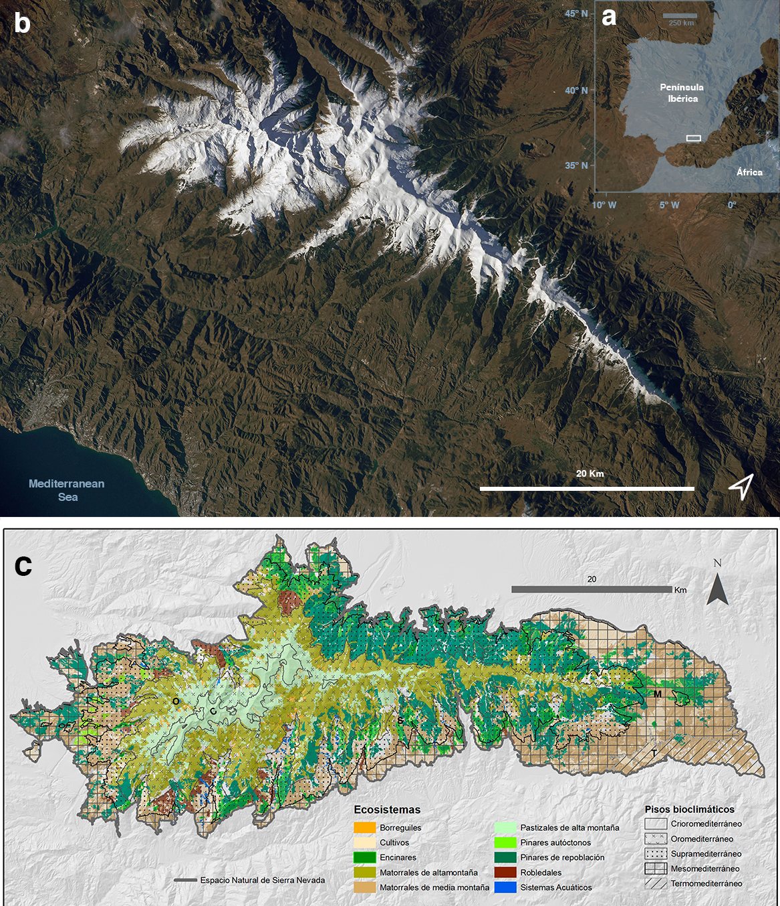

# Zona de estudio
```{r, eval=FALSE}
# tomado en parte de
# - Señales del cambio global en el sitio LTER-Sierra Nevada (pérez-luque ecosistemas)
```

Sierra Nevada es una región montañosa situada en el sur de Europa, que ocupa mas de 2.000 km^2. Presenta un rango altitudinal que varía entre 860 y 3.482 m, incluyendo la cumbre más alta de la Península Ibérica (Mulhacén). El clima es mediterráneo, caracterizado por inviernos fríos y veranos calurosos, con una pronunciada sequía estival. La temperatura media anual desciende en altitud desde los 12-16ºC por debajo de los 1.500 m hasta los 0ºC por encima de los 3.000 m de altitud. La precipitación media anual es muy irregular, con valores que oscilan entre los 250 y los 700 mm anuales, dependiendo  principalmente de la altitud y de la compleja orografía [@PeinoCalero2020AnalisisVariabilidad]. Las precipitaciones invernales son principalmente en forma de nieve por encima de los 2000 m de altitud. Geológicamente, la zona central está compuesta por rocas silíceas, principalmente micaesquistos, rodeadas de calizas y dolomías [@RodriguezFernandez2017ParqueNacional]. Esta región montañosa alberga un total de 2353 taxones de plantas vasculares, representando el 33 % y el 20 % de la flora de España y de Europa respectivamente [@Lorite2016UpdatedChecklist]. Además presenta una alta tasa de endemicidad con 95 taxones vegetales endémicos [@Loriteetal2007EstimationThreatened; @Loriteetal2020FloraSNevadaTrait]. Sierra Nevada contiene 27 hábitats tipo incluidos en la Directiva Hábitats, 28 especies de aves del Anexo I de la Directiva Aves y 15 especies de animales incluidas en el Anexo II de la Directiva Hábitats (1 reptil, 2 anfibios, 7 mamíferos y 5 invertebrados). Todo ello hace que esté considerada como uno de los *hotspots* de biodiversidad más importantes en la Región Mediterránea [@Blanca1996ProteccionFlora; @Blancaetal1998ThreatenedVascular; @MedailQuezel1999BiodiversityHotspots;  @Canadasetal2014HotspotsHotspots]. En Sierra Nevada hay 61 municipios con mas de 90 000 habitantes, siendo sus principales actividades económicas la agricultura, el turismo, la ganadería, la apicultura, la minería, y el esquí [@FernandezMarquezSalinas2009ImpactoSocioeconomico]. El alto valor de biodiversidad y geodiversidad, así como su riquerza paisajística y cultural han hecho que Sierra Nevada presente varios reconocimientos y cuente con diversas figuras legales de protección. Además de contar con un Parque Nacional y un Parque Natural, Sierra Nevada es una Reserva de la Biosfera (MaB, Unesco). Está incluida en la red Natura 2000 como Zona de Especial Protección para las Aves y Lugar de Interes Comunitario (LIC). 

Una de las características más importantes de Sierra Nevada es la existencia de marcados gradientes altitudinales, ecológicos y climáticos. Así por ejemplo, existe un fuerte contraste climático entre las laderas soleadas y secas orientadas al sur, y las laderas sombreadas y más húmedas orientadas al norte. La heterogeneidad climática y topográfica existente en Sierra Nevada ofrece una gran diversidad de microhábitats, lo que ha permitido a esta región montañosa actuar como refugio de diferentes especies [@MedailDiadema2009GlacialRefugia; @GomezLunt2007RefugiaRefugia; @BlancoPastoretal2019TopographyExplains], incluyendo especies caducifolias de *Quercus* durante la última glaciación [@Olaldeetal2002WhiteOaks; @RodriguezSanchezetal2010TreeRange; @Petitetal2002IdentificationRefugia]. 

La existencia de estos gradientes confiere a Sierra Nevada, y a las regiones montañosas en general, el carácter de un excepcional laboratorio natural de seguimiento del cambio global [@Zamora2010AreasProtegidas; @Zamoraetal2017MonitoringGlobal]. De hecho, en 2008 se estableció el Observatorio de Cambio Global de Sierra Nevada (OBSNEV) (https://obsnev.es), un programa de seguimiento a largo plazo para evaluar el impacto del cambio global en los ecosistemas nevadanses [@Aspizuaetal2010ObservatorioCambio; @BonetGarciaetal2011SierraNevada]. Esta iniciativa está recopilando información útil y relevante sobre los efectos del cambio global en los sistemas socieoecológicos de Sierra Nevada [@Zamoraetal2015HuellaCambio; @Zamoraetal2017GlobalChange; @PerezLuqueetal2016SenalesCambio] Aspizua et al. 2010, Bonet et al. 2011).[@RamosLosadaetal2017TenYears]. Asimismo, y relacionado con la temática de la presente memoria doctoral, dentro de las metodologías de seguimiento de esta iniciativa, se vienen realizando diferentes análisis sobre los efectos del cambio global en las masas de robledal [ver por ejemplo: @BonetGarciaetal2015ImpactosCambio; @Aspizuaetal2012EvaluacionGestion; @Munoz2012BosquesAutoctonos]. 

 
